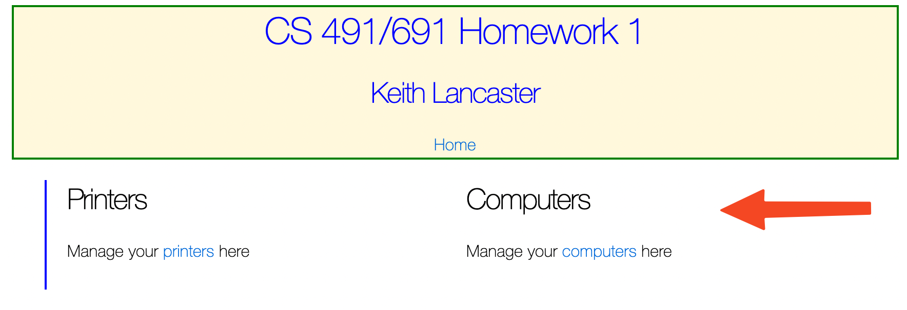

= CS 491/691 Homework 1, Sp 2022
:icons: font
:source-highlighter: highlightjs

== Overview
In this assignment, you will create a Phoenix application and modify the UI. 

== References
The idea behind this exercise is for you to learn to better navigate the Phoenix app structure, create and edit HTML, use some simple Phoenix helper functions, and experiment with CSS. 

[TIP]
====
Before you look for a reference, look at the code that was generated when you created the application or a resource. Part of the reason for using generators is to give you examples of the way that the authors of the framework recommend writing code.
====

Here are some references that should help with the assignment:

* Creating links: https://hexdocs.pm/phoenix_html/Phoenix.HTML.Link.html
* Basic HTML: https://www.w3schools.com/html/
* Beginning CSS: https://www.w3schools.com/Css/

== Preliminary Steps
* Accept the assignment from Github Classroom
* Open a terminal and cd into the directory where you want to keep your projects
* Clone the assignment to your computer
* Cloning the assignment will create a directory on your machine. 
* Change directories into the newly created project directory.
* Run the command `mix phx.new .` This will create the Phoenix project in the current directory. You will get a warning saying that this is an existing directory. You can safely ignore the warning.
* After the project creation completes, run `mix setup`
* Run the `ls` command to verify that the project files are in the project correct directory.

== Steps

1. Create a `Printer` resource in a context called `OfficeAssets`. The printer should have the following fields

* Model:string 
* Inventory code:integer 
* Office Number:integer
* Building:string
+
[TIP]
====
Use the html generator for this step. Remember to use the correct format for the fields: underscores between words, and no capital letters. "My Office", for example, would become `my_office`. Don't forget to add the resources line to the routes and to migrate the database.
====

2. Run the application, access the printers index page, and create a printer.

3. Create a `Computer` resource in the `OfficeAssets` context. The computer should have fields for the brand and the operating system version(e.g. "MacOS 11" or "Windows 10", etc).
+
[INFO]
====
When you use the generator to create the `Computer`, it will warn you that you are adding a resource to a context that is not empty. You can ignore the warning and answer "Yes" when it asks if you want to continue.
====

4. Modify the file `root.html.heex` so that it displays a header similar to the one shown here +
+

* Edit the html to fill in the text (of course, put _your name_ in the text). After the edit, your code should be similar to this:app-name:
+
[source, html]
--
<body>
<!-- your code should go  here -->
<!-- Do NOT remove the code above the body tag, and be sure to keep the inner_content function below -->
    <%= @inner_content %>
</body>
--
+
* The "Home" link should take the user to the root page. You will need to use a link helper for this.
The code for this is 
+
[source, html]
--
<%= link "Home", to: Routes.page_path(@conn,:index) %>
--

* Open `app.css` in the `assets/css` directory. Experiment with creating styles to see if you can
replicate the style used in the header.

5. Open the file `page.html.heex`. This is the page that is displayed by default when you open the application.
* You will see that the page is already laid out with columns. Change each column so that it contains the following content
+

+
Your landing page should look something like the image above when you have completed this step.

6. Update your the index, show, and form heex templates for the all the resources.
* Remove the word "Listing" from the index pages
* Capitalize every word in all the field labels
* In the show pages, change "Back" to "Computer List" or "Printer List" as appropriate

7. Ensure that all your files have been added to your Git project, and push your project to Github. In WebCampus, submit your Github clone URL for the assignment.

