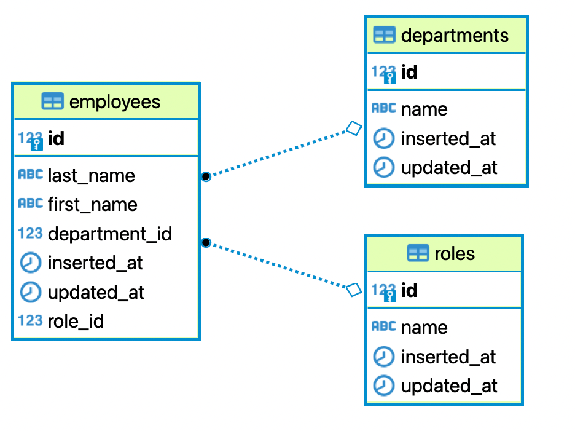
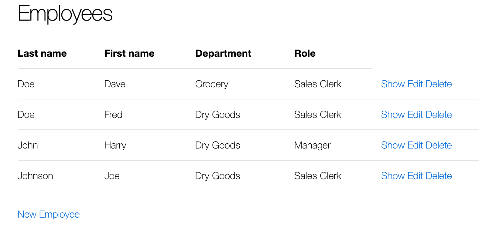
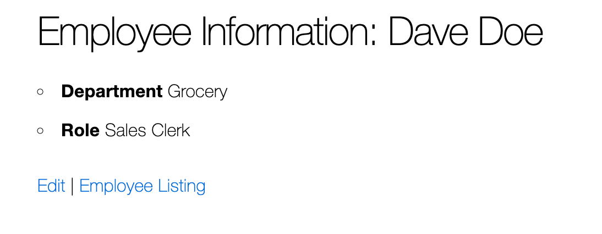
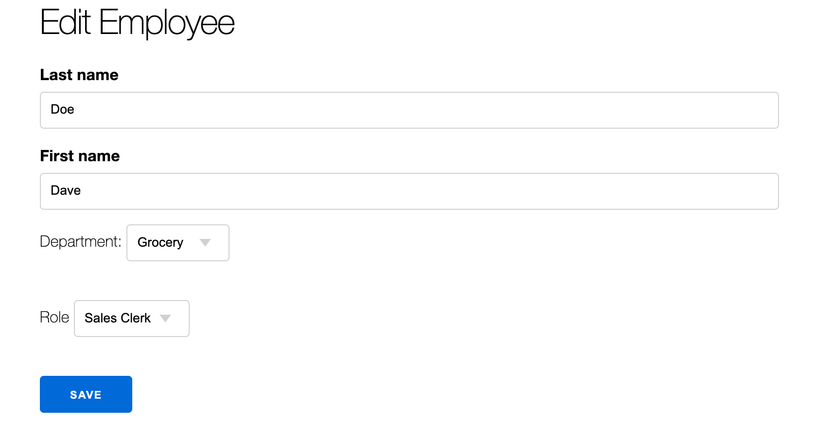
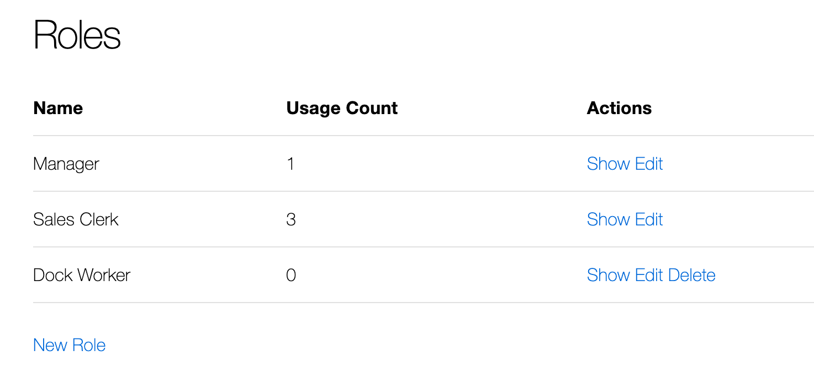
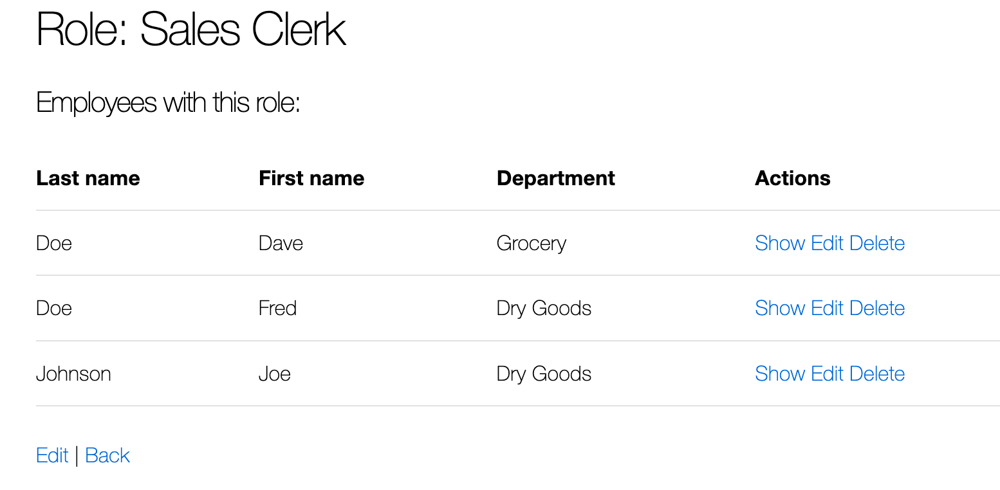
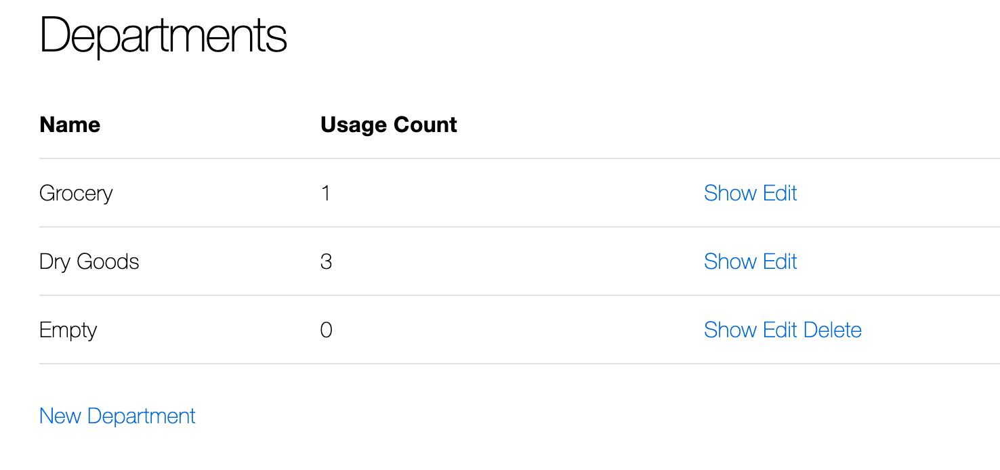
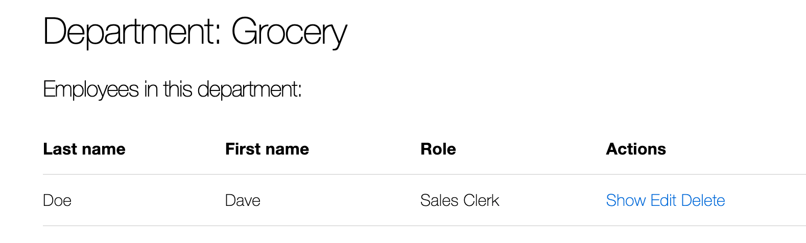

= CS 491-691 HM2: One to Many Relationships
:icons: font
:source-highlighter: highlighter.js

== Overview

In this assignment, you will create an application manage employees in a small business.


=== Data Model
You are going to build the system shown in the diagram below.




== Design Requirements

=== User Interface

.Reference Implementation

video::8z_dIbZ3aZk[youtube]

You are free to style the user interface in any manner you choose as long as the following basic elements are present:

* Header
** The header should contain a title which when clicked will return the user to the home page
** There must be links to the Employees, Roles, and Departments index pages
* Home page
** The root url ("/") must display the home page
** The home page must contain your name
* Employees Pages
** Index Page
*** Displays a table containing all employees in the system. The table should contain the department and role for each employee
+


** Show Page
*** Title line in the page must include the employee name
*** Department and role must be displayed
+


** Edit Form (used for both Edit and New)
*** The page must include fields for the last and first name
*** Dropdown menus should be used to select the role and department for the employee
+




* Roles Pages
** Index Page
*** Shows each role name and the usage count. The count is the number of employees with that role
*** Note that the _Delete_ link is not shown unless there are no employees with that role
+


** Show Page
*** Shows the role name and a table with all the employees with this role. The table should allow a user to show or edit the employee.
+


** Edit Form (used for both edit and new)
*** Allows editing the role name

* Department Pages
** Index Page
*** Shows each department, along with the number of employees assigned to the department
*** Note that departments with employees cannot be deleted
+



** Show Page
** Shows the department name and a list of all the employees in that department. The table should allow the employees to be edited.
+


** Edit Form (used for both edit and new)
*** Allows editing of the department name

== Submitting the Assignment

When you are ready, type the following commands:
```
git add .
git commit -m “your commit message”
git push origin main
```
In WebCampus, put your Github username and the clone url (see above) in the text field for the submission and submit your assignment.

== Academic Honesty
Academic dishonesty is against university as well as the system community standards. Academic dishonesty includes, but is not limited to, the following:

* Plagiarism: defined as submitting the language, ideas, thoughts or work off another as one's own; or assisting in the act of plagiarism by allowing one's work to be used in this fashion.

* Cheating: defined as (1) obtaining or providing unauthorized information during an examination through verbal, visual or unauthorized use of books, notes, text and other materials; (2) obtaining or providing information concerning all or part of an examination prior to that examination; (3) taking an examination for another student, or arranging for another person to take an exam in one's place; (4) altering or changing test answers after submittal for grading, grades after grades have been awarded, or other academic records once these are official.

Cheating, plagiarism or otherwise obtaining grades under false pretenses constitute academic dishonesty according to the code of this university. Academic dishonesty will not be tolerated and penalties can include cancelling a student’s enrollment without a grade, giving an F for the course, or for the assignment. For more details, see the University of Nevada, Reno General Catalog.

